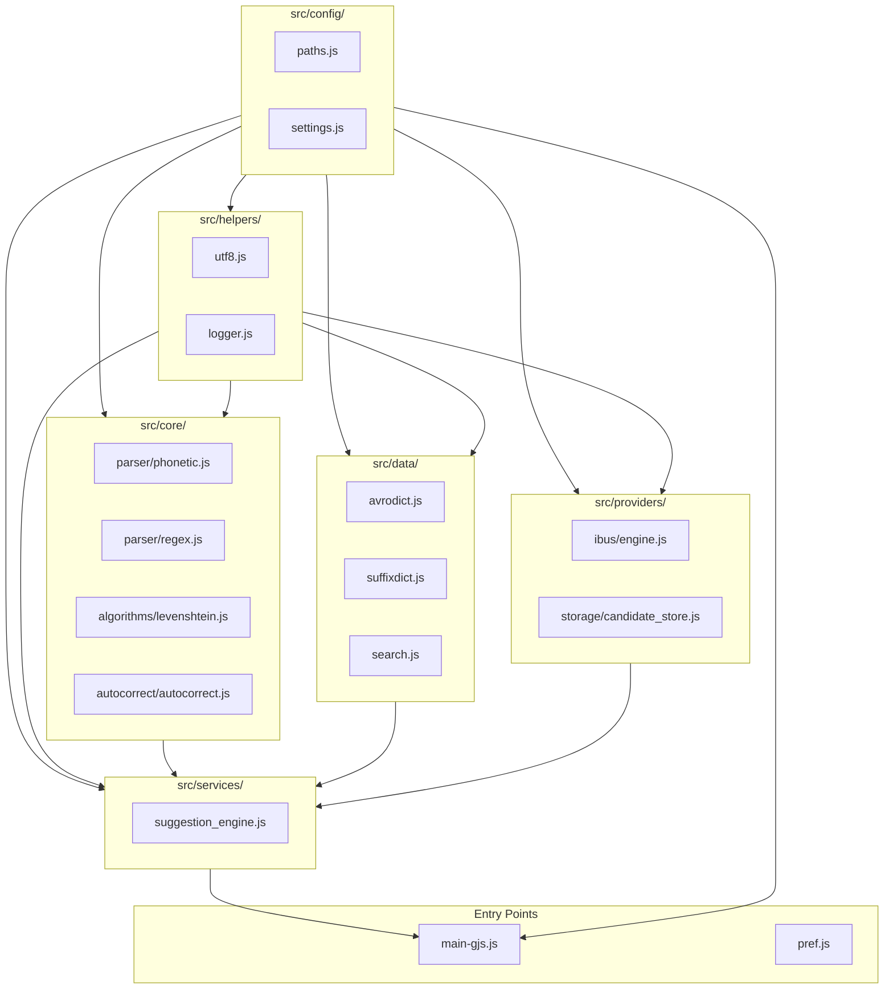

# IBus Avro — Scalable Architecture Blueprint
> *"Moving towards Clean Architecture in GJS without rewriting code: A Python Engineer's Guide"*

---

## 1. Executive Summary & Vision

This blueprint translates your established Python Clean Architecture principles (documented in `.agents/rules/`) into modern **GJS (GNOME JavaScript)** for `ibus-avro`.

### The Core Objective
* **No code rewrites:** Keep proven algorithms (`avrolib`, `suggestionbuilder`, `dbsearch`, `levenshtein`) 100% intact.
* **Pure relocation (File Movement):** Reorganize the flat root directory into a layered, unidirectional `src/` tree.
* **Unidirectional Dependency Flow:** Ensure that dependencies flow in strictly one direction (downward), preventing circular references and spaghetti code.
* **Linux/IBus Compatibility:** Maintain 100% backward compatibility with `ibus`, `gjs`, and Autotools (`Makefile.am`).

---

## 2. Python vs GJS Module Architecture Mapping

Since you are accustomed to Python's import system, here is how GJS native module namespaces map directly to Python:

| Python Standard Pattern | GJS Equivalent (`imports.searchPath`) | Responsibility |
| :--- | :--- | :--- |
| `from src.config import Settings` | `const config = imports.config;` | Gearbox / Single Source of Truth |
| `from src.core.parser import Phonetic` | `const core = imports.core.parser;` | Pure transliteration & algorithms (zero OS/UI knowledge) |
| `from src.providers.ibus import Engine` | `const providers = imports.providers.ibus;` | External OS bindings (IBus, GSettings, GIO) |
| `from src.services.suggestion import SuggestionService` | `const services = imports.services.suggestion;` | Fan-in orchestrator (combines core + data + storage) |
| `from src.helpers import utf8` | `const helpers = imports.helpers;` | Shared cross-module utilities |
| `main.py` | `main-gjs.js` | Lean entry point only |

---

## 3. The Target Directory Structure (`src/`)

```
ibus-avro/
├── main-gjs.js                      # 🚪 Entry Point (Lean Bootstrap only)
├── pref.js                          # 🚪 Preferences Entry Point
├── setup.sh                         # Automated build & install script
├── Makefile.am                      # Autotools build recipe
├── configure.ac                     # Autotools config
│
├── src/
│   │
│   ├── config/                      # ⚙️ LAYER 1: Single Source of Truth (The Gearbox)
│   │   ├── paths.js                 # PKGDATADIR, installation paths (from evars.js)
│   │   ├── settings.js              # Timeouts, prune limits (2000), debounce times (2000ms)
│   │   └── index.js                 # Exports all configuration in a single namespace
│   │
│   ├── core/                        # 🧠 LAYER 2: Pure Domain Logic (Zero UI / OS / IBus dependencies)
│   │   ├── parser/
│   │   │   ├── phonetic.js          # Former avrolib.js (Avro phonetic parser engine)
│   │   │   └── regex.js             # Former avroregexlib.js (Phonetic regex rules)
│   │   ├── algorithms/
│   │   │   └── levenshtein.js       # Former levenshtein.js (Edit distance metric)
│   │   └── autocorrect/
│   │       └── autocorrect.js       # Former autocorrect.js (Phonetic typo correction rules)
│   │
│   ├── data/                        # 📚 LAYER 2: Static Databases & Dictionaries
│   │   ├── avrodict.js              # Base phonetic dictionary (7.7 MB)
│   │   ├── suffixdict.js            # Bengali suffix patterns
│   │   └── search.js                # Former dbsearch.js (Trie & database traversal)
│   │
│   ├── providers/                   # 🔌 LAYER 3: External Integrations & Platform Wrappers
│   │   ├── ibus/
│   │   │   └── engine.js            # IBus Engine implementation (subclassing IBus.Engine)
│   │   └── storage/
│   │       └── candidate_store.js   # GIO asynchronous file I/O wrapper
│   │
│   ├── services/                    # 🏗️ LAYER 4: Use-Case Orchestration (Fan-in Point)
│   │   ├── suggestion_engine.js     # Former suggestionbuilder.js (adaptive learning & ranking)
│   │   └── index.js                 # Service registry
│   │
│   ├── helpers/                     # 🌐 LAYER 1: Global Utilities (Available everywhere)
│   │   ├── utf8.js                  # Former utf8.js (UTF-8 encoding helpers)
│   │   └── logger.js                # Centralized, safe logging helper
│   │
│   └── ui/                          # 🖥️ LAYER 5: Presentation / UI
│       ├── avropref.ui              # Glade / GTK XML layout
│       └── assets/
│           └── avro-bangla.png      # Engine icon
│
├── tests/                           # 🧪 Automated Verification & Benchmarks
│   ├── README.md
│   ├── benchmark.js
│   ├── benchmark_adaptive.js
│   ├── benchmark_uncached.js
│   ├── benchmark_parser.js
│   ├── benchmark_regex.js
│   └── test_adaptive.js
│
├── docs/                            # 📖 Architecture Documentation
│   └── scalable_architecture_guide.md
│
└── .agents/                         # 🤖 Engineering Rules & Customizations
    └── rules/
        ├── architecture-patterns.md
        ├── coding-standards.md
        └── maintenance-testing.md
```

---

## 4. Unidirectional Dependency Flow

Just as defined in `architecture-patterns.md`:
> *"Water never flows upward — imports always flow downward."*



---

## 5. File Relocation Matrix (Moving Without Rewriting)

| Current File (Flat Root) | Target Clean Architecture Path | Code Changes Required |
| :--- | :--- | :--- |
| `evars.js` / `evars.js.in` | `src/config/paths.js` | None (change import path only) |
| *Scattered constants* | `src/config/settings.js` | Extract timeout, prune limits, paths |
| `avrolib.js` | `src/core/parser/phonetic.js` | **0 lines changed** |
| `avroregexlib.js` | `src/core/parser/regex.js` | **0 lines changed** |
| `levenshtein.js` | `src/core/algorithms/levenshtein.js` | **0 lines changed** |
| `autocorrect.js` | `src/core/autocorrect/autocorrect.js` | **0 lines changed** |
| `avrodict.js` | `src/data/avrodict.js` | **0 lines changed** |
| `suffixdict.js` | `src/data/suffixdict.js` | **0 lines changed** |
| `dbsearch.js` | `src/data/search.js` | Update internal import of `avrodict` |
| `suggestionbuilder.js` | `src/services/suggestion_engine.js` | Update internal import of core/data/config |
| `utf8.js` | `src/helpers/utf8.js` | **0 lines changed** |
| `avropref.ui` | `src/ui/avropref.ui` | **0 lines changed** |
| `avro-bangla.png` | `src/ui/assets/avro-bangla.png` | Update path in `Makefile.am` |
| `main-gjs.js` | `main-gjs.js` *(remains at root)* | Becomes lean entry point loading `src/` |

---

## 6. How GJS Imports Work in the New Architecture

In GJS, directories act as objects. When `src/` is registered in `imports.searchPath`:

```javascript
// At the top of main-gjs.js:
const GLib = imports.gi.GLib;
imports.searchPath.unshift('/usr/share/ibus-avro/src');
imports.searchPath.unshift('./src');

// Now you import directly like Python packages:
const config   = imports.config.settings;
const core     = imports.core;
const data     = imports.data;
const services = imports.services;

// Usage:
var sb = new services.suggestion_engine.SuggestionBuilder();
var parser = core.parser.phonetic.OmicronLab.Avro.Phonetic;
```

---

## 7. Autotools (`Makefile.am`) Transition

To install all subdirectories under `src/` cleanly into `/usr/share/ibus-avro/src/`, `Makefile.am` can use the recursive wildcard install target:

```make
# In Makefile.am
pkgdatadir = $(datadir)/ibus-avro

install-data-local:
	mkdir -p $(DESTDIR)$(pkgdatadir)/src
	cp -r src/* $(DESTDIR)$(pkgdatadir)/src/
	mkdir -p $(DESTDIR)$(pkgdatadir)/ui
	cp -r src/ui/* $(DESTDIR)$(pkgdatadir)/ui/
```

This ensures that `make install` automatically handles all new files and subfolders without needing to manually list 50 files in `Makefile.am`.

---

## 8. Migration Phases & Safety Verification

To ensure zero downtime and prevent regressions:

1. **Phase 1: Verification Baseline (Done)**
   - All tests in `tests/` pass (10/10 automated tests, 4 benchmarks).
2. **Phase 2: Directory Scaffolding**
   - Create `src/config`, `src/core`, `src/data`, `src/services`, `src/providers`, `src/helpers`, `src/ui`.
3. **Phase 3: File Moving (`git mv`)**
   - Use `git mv` to preserve git commit history for all original files.
4. **Phase 4: SearchPath Alignment**
   - Configure `src/` in `imports.searchPath`.
5. **Phase 5: Automated Verification**
   - Run `node tests/test_adaptive.js` and `gjs tests/benchmark.js`.
   - Run `sudo make install && ibus restart` to confirm live typing works seamlessly.
